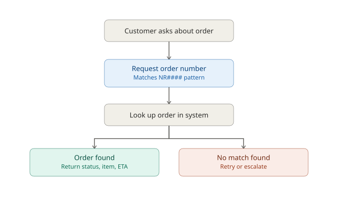
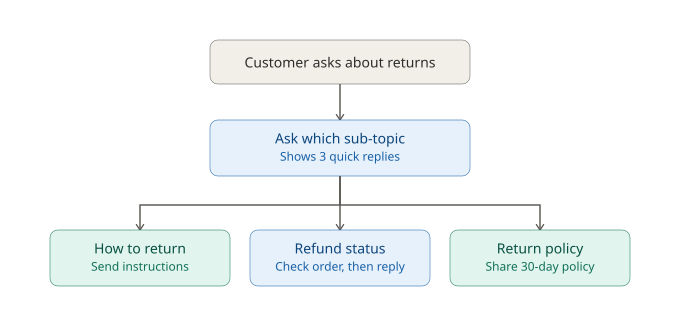
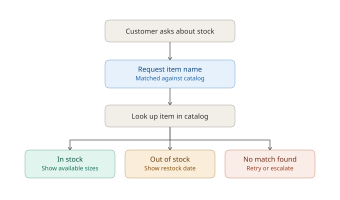

# Decision-Tree Design — Northstar Support Assistant
**Satisfies Task Board #4** — "Design decision-tree logic for all 3 flows (order, returns, stock)"

This document is the design record for the chatbot's matching logic — it maps directly to the `route()` function in `script.js`. It's separate from the Charter/Board (team process), README (how to run it), and go-live note (handoff status) because it answers a different question: *what does the bot actually decide, and why*.

## 1. Order status

| Step | Logic |
|---|---|
| Trigger phrases | "order status", "where's my order", "has this shipped" |
| Ask | Order number (expects `NR####` pattern) |
| Lookup | Match against `ORDERS` object |
| Found | Return item, status, and ETA — marked Resolved |
| Not found | Offer retry or hand off to a staff — marked Escalated |

## 2. Returns & refunds

| Step | Logic |
|---|---|
| Trigger phrases | "return", "refund", "returns & refunds" |
| Ask | Which of 3 sub-topics (quick replies) |
| How to return | Static instructions — Resolved |
| Refund status | Asks for order number, then checks whether that order is marked `Delivered` before replying — Resolved either way, no escalation path here |
| Return policy | Static 30-day policy text — Resolved |

## 3. Stock availability

| Step | Logic |
|---|---|
| Trigger phrases | "stock availability", "back in stock", "different size" |
| Ask | Item name (free text) |
| Lookup | Match against `STOCK` object (close string match, not fuzzy) |
| In stock | Return available sizes — Resolved |
| Out of stock | Return restock date — Resolved |
| Not found | Offer retry or hand off to a staff — Escalated |

---
